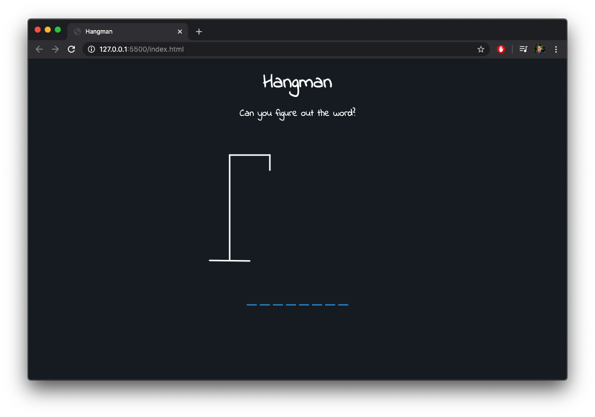
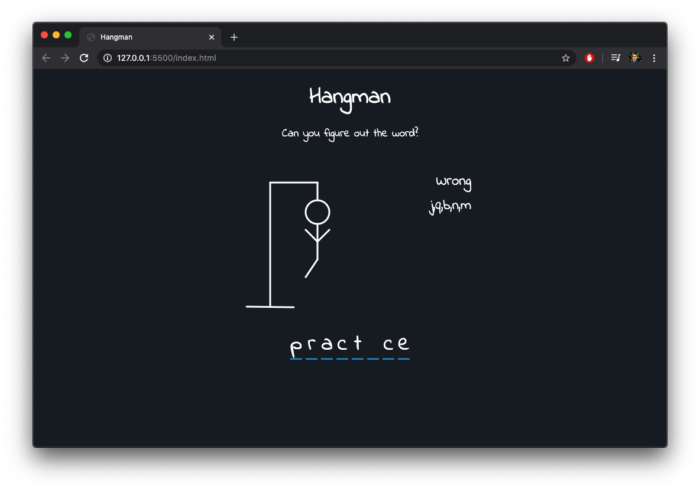
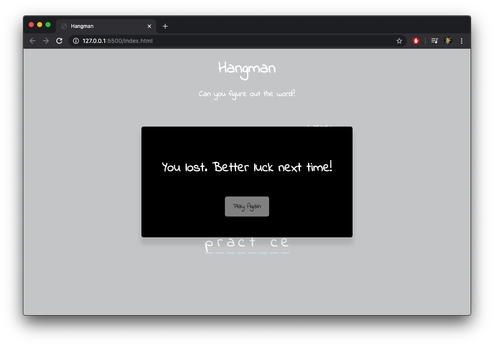

# Hangman: A game to find the hidden word. 
by mrivasperez live demo: https://mrivasperez.github.io/Hangman/
## About
Everybody loves to play hangman when they are bored! I created an online version of the game written in HTML, CSS, and Vanilla JS (ES6). I had a lot of fun making this and hope you have a lot of fun playing it and making it your own. Stay tuned for a Medium post on how to make it for yourself as well as reasons I believe that writing this game is the best way to master basic JS concepts.
## Screenshots

> The main screen

> A screenshot of a game underway. One right letter left to win, one wrong letter left to lose!

> A screenshot of a lost game with the option to play again.

## How to Play
This game is only available on devices with physical keyboards as the script relies on JS keycodes. To begin playing type any letter on the keyboard. 

If the letter is right, you will see it displayed on the word section under the hangman, if it is wrong, then the letter will be displayed to the right of the hangman and a limb of the hangman will be drawn. 

When all limbs of the hangman are drawn, you have lost. 

Once all letters are filled in, you have won.
